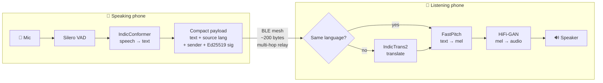

<div align="center">


# iTantra

### Speak in your language. Be heard in theirs. No internet required.

**A fully offline, multilingual voice walkie-talkie for ordinary Android phones, carried over a Bluetooth mesh.**

*Indian Multilingual TTS & STT Aided Neural Transceiver for Low-Bitrate Links*


[The idea](#-the-idea-in-one-picture) · [Why it matters](#-the-problem) · [Features](#-what-it-does) · [How it works](#%EF%B8%8F-how-it-works) · [Hard parts](#-the-hard-parts-we-solved) · [Status](#-honest-project-status) · [Build](#-build-and-run)

</div>

---

## ⚡ TL;DR

- **The problem:** when disaster strikes, the cell network goes first, and the phone in your pocket stops being a communication device. Rescuers and victims often don't even share a language.
- **The idea:** turn speech into text on the speaker's phone, send *only the text* over a phone-to-phone Bluetooth mesh, and turn it back into speech on the listener's phone, **translated into the listener's own language**.
- **Why it works:** a spoken sentence is tens of kilobytes of audio but only a couple of hundred bytes of text. That ~100× reduction is what makes real-time voice possible over a link as thin as Bluetooth LE.
- **What's built:** speech recognition, speech synthesis, translation and voice detection all run **on-device** in 10 Indian languages (9 with the complete voice loop), over a signed, optionally end-to-end-encrypted, multi-hop BLE mesh, with a one-tap SOS that keeps spreading for an hour.

> **No towers. No servers. No accounts. No SIM. No literacy required.**

---

## 💡 The idea in one picture

```
   ┌─ Priya's phone (Hindi) ───────┐              ┌─ Arjun's phone (English) ──────────────┐
   │                               │              │                                        │
   │  🎤 "मुझे पानी चाहिए"          │   ~200 bytes │   🔊 "I need water"                      │
   │                               │    of text   │                                        │
   │  mic → VAD → speech-to-text   │ ───────────► │  translate → text-to-speech → speaker  │
   │  Silero   IndicConformer      │   BLE mesh   │  IndicTrans2   FastPitch + HiFi-GAN    │
   └───────────────────────────────┘  (multi-hop) └────────────────────────────────────────┘

             Only text crosses the link. Audio never does.
             The sender never translates. Every receiver translates for itself.
```

Because translation happens **on arrival**, a single Hindi broadcast is heard in Hindi by a Hindi speaker and in English by an English speaker *at the same time*, each on their own phone, with no one choosing a "target language" up front.

---

## 🌊 The problem

When a flood takes out the towers, or you are three valleys past the last bar of signal, the smartphone in your pocket becomes a camera. Everything that makes it useful for talking to people assumes infrastructure, and infrastructure is exactly what disappears first.

Existing answers each miss something:

| Option | What goes wrong |
|---|---|
| Cellular / internet apps | Dead the moment the tower is down or saturated |
| Satellite phones | Expensive, rare, one-to-one |
| Two-way radios | Extra hardware someone has to own, carry and charge; not what a volunteer has on them |
| Offline text-mesh apps | Require reading and typing, often in a script the user doesn't have a keyboard for |
| **All of the above** | **None of them let a Tamil speaker be understood by a Marathi speaker** |

India has 22 scheduled languages and hundreds of millions of people for whom reading and typing is not the natural interface. **Voice is the most inclusive interface there is.** A tool meant for the worst day of someone's life should not require literacy as a prerequisite.

## 🎯 Who it's for

| | Who | Why iTantra |
|---|---|---|
| 🚑 | **Disaster and emergency responders** | Search parties and relief volunteers who were handed phones, not radios |
| 🏔️ | **Rural and remote communities** | Villages, forests, hills and border areas where coverage is thin on a good day |
| 🗣️ | **Mixed-language teams** | A Malayalam-speaking medic and a Bengali-speaking family, without either of them typing |
| 👂 | **Non-literate users** | The loop starts and ends in speech. You never have to read anything |

### When you'd reach for it

| Situation | What iTantra gives you |
|---|---|
| Cell network down after a flood, quake or cyclone | Phone-to-phone voice with zero infrastructure |
| Trekking, forest patrol, remote fieldwork | Group comms out of coverage, no radios to carry |
| Crowded event with a congested network | A channel that doesn't depend on the tower at all |
| Relief camp with mixed-language teams | Speak your language, be heard in theirs |
| Urgent instruction to everyone nearby | **Alert mode**: max volume, bypasses silent mode |
| Trapped, hurt or separated | **One-tap SOS** that keeps propagating for an hour and reaches people who arrive later |
| Someone can't read or type | They hold a button and talk |

---

## ✨ What it does

### 🎙️ Voice that travels as text
Hold to talk on one phone, hear it on another. Silero VAD detects real speech so recognition never runs on silence, IndicConformer transcribes it, and only the text goes over the air. **Audio is never put on the wire**, not compressed and not as a fallback.

### 🌐 Everyone hears their own language
The sender speaks in *their* language and tags the message. Each receiving phone translates into *its* language with IndicTrans2 and speaks it aloud. If the languages already match, translation is skipped and no model is even loaded. Hindi ↔ English today.

### 📡 Multi-hop Bluetooth LE mesh
Built on the [bitchat](https://github.com/permissionlesstech/bitchat-android) stack: automatic peer discovery, no pairing, no accounts, and relay through intermediate phones to reach people out of direct range. The home screen lists everyone reachable, tagged `direct` or with a hop count.

### 🆘 Distress announcements that outlive the moment
One tap sends an SOS with your coordinates (if the phone has a fix). It keeps propagating for **an hour**, and every phone holding it re-announces to phones it newly meets, so a search party arriving forty minutes later still hears it. Tapping it shows the origin, your position, and the distance between them. It can be marked resolved.

### 🚨 Alert mode
Urgent messages play on the alarm stream at maximum volume and can't be interrupted. They get through even if the receiver's phone is on silent in a pocket.

### 🔐 Signed by default, encrypted on request
Every message is **Ed25519-signed**, so a relay can't forge or tamper with it. Flip the lock and messages go out **Noise-protocol end-to-end encrypted** per peer instead. The UI always says which mode you're in rather than leaving you to assume.

### 💬 Voice and text in one thread
Every message exists as both. Type when you can't speak, tap to hear any message read aloud, or let messages auto-speak on arrival.

### 🪪 Private, local identity
Pick a display name. The app generates a Curve25519 keypair on first launch, keeps the private key in the **Android Keystore**, and derives your peer ID from its fingerprint. Nothing leaves the device.

### 📦 Verified, on-demand language packs
Models download once from inside the app, like an offline map. Every file is checked against a **SHA-256 recorded in a manifest that ships inside the APK**, with a mirror to fall back on. No published hash, no install: there is no "trust it anyway" path. Only one language stays in RAM at a time, so it runs on low-end hardware.

---

## 🗣️ Languages

Multi-select: enable as many as you need and switch mid-conversation without restarting.

| Language | | Code | Speech → text | Text → speech | Translation |
|---|---|---|:---:|:---:|:---:|
| Hindi | हिन्दी | `hi` | ✅ | ✅ | ✅ ↔ English |
| English | English (Indian) | `en` | ✅ | ✅ | ✅ ↔ Hindi |
| Bengali | বাংলা | `bn` | ✅ | ✅ | — |
| Gujarati | ગુજરાતી | `gu` | ✅ | ✅ | — |
| Kannada | ಕನ್ನಡ | `kn` | ✅ | ✅ | — |
| Malayalam | മലയാളം | `ml` | ✅ | ✅ | — |
| Marathi | मराठी | `mr` | ✅ | ✅ | — |
| Tamil | தமிழ் | `ta` | ✅ | ✅ | — |
| Telugu | తెలుగు | `te` | ✅ | ✅ | — |
| Odia | ଓଡ଼ିଆ | `or` | ❌ none published | exportable | — |

✅ means a verified, quantized model is published and installable from the in-app **Language Packs** screen.

**Why Odia is missing:** AI4Bharat hasn't published an Odia recognition model in an exportable form, so a voice pack could speak but never listen. Shipping half a loop would be worse than saying it's missing.

**Why translation is Hindi ↔ English only:** those are the two languages where translation was verified end to end. A phone only stores the direction *into* its own language, so an English handset holds Hindi→English and nothing else.

---

## ⚙️ How it works



1. **Detect.** Silero VAD decides when you are actually speaking, which keeps idle battery drain low.
2. **Transcribe.** IndicConformer converts speech to text with greedy CTC decoding, fully on-device.
3. **Package.** The text is wrapped in a compact payload (message id, type, source language, sender name, peer id, device model, timestamp) and signed.
4. **Relay.** The bitchat mesh carries it hop by hop to peers out of direct range, with gossip sync and store-and-forward.
5. **Translate.** The receiver reads the source-language tag and translates with IndicTrans2 only if it differs from its own.
6. **Speak.** FastPitch generates a mel spectrogram and HiFi-GAN turns it into audio.

**Nothing in the speak → transmit → hear loop touches the internet.** The only network code in the app is the model downloader.

### Tech stack

| Layer | Technology |
|---|---|
| App | Kotlin, Jetpack Compose, Coroutines (min Android 8.0 / API 26) |
| On-device inference | ONNX Runtime Mobile, int8-quantized models |
| Voice activity detection | Silero VAD |
| Speech recognition | AI4Bharat IndicConformer (CTC) |
| Speech synthesis | AI4Bharat Indic-TTS: FastPitch + HiFi-GAN |
| Translation | AI4Bharat IndicTrans2 (distilled 200M, encoder–decoder) |
| Transport | bitchat BLE mesh: GATT client + server, fragmentation, relay, gossip sync |
| Crypto | Ed25519 signatures, Noise protocol E2E, Curve25519 identity in Android Keystore |
| Model tooling | Python export, quantization and verification pipeline in `model-export/` |

---

## 🧠 The hard parts we solved

This is not a wrapper around a cloud API. Everything below runs on a phone with the radio as the only link.

- **Three neural pipelines on a phone, in ten languages.** Speech recognition, speech synthesis and translation all run locally through ONNX Runtime. Synthesis models were exported and int8-quantized to roughly **85 MB per language** by our own tooling in `model-export/`.
- **A SentencePiece tokenizer rewritten in pure Kotlin.** IndicTrans2 needs SentencePiece BPE, which has no drop-in Android library. We reimplemented it and **diffed it piece-for-piece against the reference library** before trusting it (`SpmBpeTokenizer.kt`, with unit tests).
- **Log-mel feature extraction on-device**, matching what the recognition model was trained on, with unit tests (`MelSpectrogramTest.kt`).
- **Fixed CTC token decoding** for IndicConformer so the published models produce correct text.
- **Receiver-side translation as an architecture choice.** Translating on send forces one target language and kills multilingual broadcast. Translating on receive lets one message reach any number of languages at once, and each phone stores only one model direction.
- **Every synthesis model is spectrally checked** (envelope dynamic range, active-frame fraction, spectral tilt) before being published, and ships a sample WAV.
- **Supply-chain-safe model delivery.** Hashes are pinned inside the APK, so a compromised mirror can't push a tampered model.
- **Hop-count range policy.** Reach is capped by hops, which works with no GPS fix at all (the normal case inside a collapsed building). GPS, when both ends have it, can only *tighten* that bound, never widen it (`RangePolicy.kt`, with unit tests).
- **Honest BLE diagnostics.** Discovery failures are diagnosed and surfaced instead of failing silently, because "nobody nearby" and "Bluetooth is off" must never look the same to someone in trouble.

---

## 🧭 Design principles

| Principle | What it means in practice |
|---|---|
| **No audio on the wire, ever** | The bandwidth argument collapses the moment audio is serialized, so it simply isn't allowed |
| **Offline means offline at runtime** | No hosted API anywhere in the voice loop. Language packs are provisioned like offline maps |
| **Nothing unverified gets installed** | A model installs only if both its URL and SHA-256 are in the shipped manifest |
| **Translate on receive, never on send** | One broadcast, every language, each phone stores only what it needs |
| **A failed translation says so** | Untranslated text is labelled, never passed off as translated. In an SOS, a silently wrong line is worse than an obviously missing one |
| **Translation is optional** | The voice loop never depends on it, so it can be absent or slow without breaking the core feature |
| **Hops first, GPS second** | The UI says "3 hops away", not an invented distance in kilometres |
| **Address a person, not a crowd** | Conversations start from a peer. SOS is the deliberate exception |

---

## 📊 Honest project status

We would rather under-claim than over-claim.

| Status | Area |
|:---:|---|
| ✅ | **Voice packs published for nine languages**: recognition and synthesis for Hindi, English, Bengali, Gujarati, Kannada, Malayalam, Marathi, Tamil and Telugu. Downloadable in-app and SHA-256 verified |
| ✅ | **Hindi ↔ English translation** verified sentence by sentence against reference output |
| ✅ | **App wired end to end**: BLE mesh transport, identity, peer discovery, multi-hop peer visibility, targeted messaging, typed text, read-aloud, alert mode, push-to-talk capture, multi-select languages, distress announcements, Model Manager with SHA-256 verification |
| ⏳ | **Not yet proven on real hardware**: two-phone discovery, mesh delivery, SOS propagation across relays, and end-to-end spoken latency. BLE behaves differently on real radios and per-manufacturer power management, so we don't claim these from a desktop |
| 📋 | **Planned**: translation beyond Hindi ↔ English, KV-cached decoding for faster translation, Odia recognition, raw-audio bypass mode |

**No performance numbers appear in this README because none have been measured on a phone yet.** Translation currently uses greedy decoding without a key/value cache; that's a speed limitation, not a correctness one, and it's the first thing on the optimisation list.

### Model footprint

| Component | Size | Source |
|---|---|---|
| Speech recognition | per language | Published Apache-2.0 exports of AI4Bharat weights |
| Speech synthesis | ~85 MB per language (int8) | Exported locally by `model-export/` |
| Translation | ~230–270 MB for the one direction a phone needs | MIT-licensed ONNX conversions of IndicTrans2 |
| Voice activity detection | bundled in the APK | Silero |

---

## 🛠️ Build and run

Requires **JDK 17** and a `local.properties` pointing at your Android SDK.

```bash
./gradlew assembleDebug        # → app/build/outputs/apk/debug/app-debug.apk
./gradlew testDebugUnitTest    # tokenizer, mel-spectrogram and range-policy tests
```

The debug build targets `arm64-v8a` and `armeabi-v7a` only. An emulator can't exercise a Bluetooth mesh, so x86 native code is left out rather than adding tens of megabytes nobody would use.

### Getting speech onto a phone

**The real-user path:** install the APK, open **Language Packs**, and download a language. It shows *Ready* once verified.

**The developer path** (to test a language before it's hosted anywhere): run the export first (see `model-export/README.md`), then push the models:

```bash
adb install -r app/build/outputs/apk/debug/app-debug.apk
adb shell mkdir -p /sdcard/Android/data/com.itantra/files/models/hi
adb push model-export/out/hi/. /sdcard/Android/data/com.itantra/files/models/hi/

# Translation (optional). A phone only needs the direction *into* its own language:
adb push model-export/mt/staged/hi/. /sdcard/Android/data/com.itantra/files/models/hi/
adb push model-export/mt/staged/en/. /sdcard/Android/data/com.itantra/files/models/en/
```

`model-export/README.md` has the full checklist, how to export the remaining languages, and the pinned dependency versions.

### Try the demo

1. Install on two (or more) Android phones and turn on Bluetooth.
2. On each phone, pick a display name and install a language pack: say **Hindi** on one and **English** on the other.
3. Pick the other phone from the home screen's peer list.
4. Hold the talk button and speak Hindi. The other phone speaks it back **in English**.
5. Put phones in **airplane mode (with Bluetooth on)** and repeat. It still works.
6. Tap **SOS**, then bring a third phone into range later and watch it receive the distress call.

---

## 🗂️ Repository tour

```
app/src/main/java/com/itantra/
├── stt/            speech-to-text: IndicConformer, log-mel features, CTC decoding
├── tts/            text-to-speech: FastPitch + HiFi-GAN, audio output
├── translate/      IndicTrans2 + pure-Kotlin SentencePiece BPE tokenizer
├── mesh/           BLE mesh transport, Noise encryption, relay, gossip sync, SOS, range policy
├── identity/       Keystore-backed Curve25519 identity
├── models/         model catalog and SHA-256-verified download manager
├── services/       message storage, retention, verification, mesh graph routing
└── ui/             Compose screens: onboarding, home, transceiver, language packs
model-export/       Python tooling to export, quantize, verify and publish models
```

---

## 🚀 Roadmap

- [ ] Field test on real phones: discovery, multi-hop delivery, SOS propagation, spoken latency
- [ ] Translation across all nine voice languages, not just Hindi ↔ English
- [ ] KV-cached decoding to speed up translation
- [ ] Odia speech recognition
- [ ] Raw-audio bypass mode for languages without a model
- [ ] Battery and range benchmarks on low-end devices

---

## 🙏 Acknowledgements

iTantra stands on the shoulders of open work:

- [**bitchat**](https://github.com/permissionlesstech/bitchat-android): the Bluetooth mesh transport
- [**AI4Bharat**](https://ai4bharat.iitm.ac.in/): IndicConformer, Indic-TTS and IndicTrans2
- [**Silero**](https://github.com/snakers4/silero-vad): voice activity detection
- [`indicconformer-sherpa-onnx`](https://huggingface.co/parismitaglobalsolutions/indicconformer-sherpa-onnx): Apache-2.0 ONNX exports of the AI4Bharat recognition models, which saved us exporting nine languages ourselves
- [`indictrans2-*-dist-200M-onnx`](https://huggingface.co/TigreGotico): MIT-licensed ONNX conversions of IndicTrans2, which saved a second export pipeline

<div align="center">

---

**Built for the day the network goes quiet.**

*When the towers fall, people still need to talk, and they shouldn't need to share a language to do it.*

</div>
