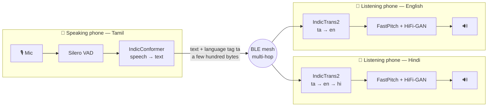
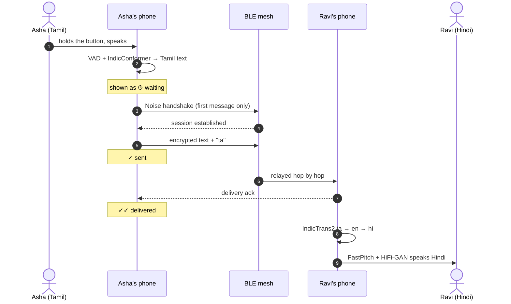

<div align="center">


# iTantra

### Speak in your language. Be heard in theirs. No network required.

A fully offline, multilingual voice transceiver for Android. Words spoken into one phone come
out of another phone's speaker — across a Bluetooth mesh, with no internet, no cell tower, no
servers and no accounts.

<p>
  <a href="https://github.com/raunaksahahere/iTantra/actions/workflows/android.yml"></a>
  
  
  
  
  <br/>
  
  
  
  
</p>

<sub><b>I</b>ndian Multilingual <b>T</b>TS & STT <b>A</b>ided <b>N</b>eural <b>T</b>ransceiver for Low-Bitrate Links</sub>

<p>
  <a href="#-the-idea">The idea</a> •
  <a href="#-who-its-for">Who it's for</a> •
  <a href="#-features">Features</a> •
  <a href="#-languages">Languages</a> •
  <a href="#-how-it-works">How it works</a> •
  <a href="#-build-and-run">Build</a> •
  <a href="#-project-status">Status</a>
</p>

</div>

---

## 💡 The idea

**Your voice never crosses the link.** The speaking phone turns speech into text on-device,
only that text travels over the mesh, and the listening phone turns it back into speech
on-device — translated into *its* reader's language on the way.

|  | Sent over the air | Size for one spoken sentence |
|---|---|---|
| A voice call | compressed audio | tens of kilobytes |
| **iTantra** | **text + a language tag** | **a couple of hundred bytes** |

That difference is what makes real-time voice possible over a link as thin as Bluetooth LE,
relayed phone to phone.

## 🧭 Why it exists

When a flood takes out the towers, or you are three valleys past the last bar of signal, the
phone in your pocket becomes a camera. Everything that makes it useful for talking to people
assumes infrastructure that is exactly what disappears first.

Radio handsets solve this, but they are extra hardware somebody has to own, carry and
charge — and they do not speak Marathi to a Tamil speaker.

Voice is also the most inclusive interface there is. It works whether or not you can read,
whether or not you can type in your own script, and whether or not you have ever used a
messaging app. A tool meant for the worst day of someone's life should not require literacy
as a prerequisite.

## 👥 Who it's for

- **Disaster and emergency responders** — search parties, relief coordinators and volunteers
  working where the network is down or saturated. Teams that were handed phones, not radios.
- **Rural and remote communities** — villages, forests, hills and border areas where coverage
  is thin on a good day and absent on a bad one.
- **Anyone who needs to be understood across a language line** — a Malayalam-speaking medic
  and a Bengali-speaking family, without either of them typing.
- **Non-literate users** — the loop starts and ends in speech. You never have to read anything.

| Situation | What iTantra gives you |
|---|---|
| Cell network down after a flood, quake or cyclone | Phone-to-phone voice with zero infrastructure |
| Trekking, forest patrol, remote fieldwork | Group comms out of coverage, no radios to carry |
| Crowded event with a congested network | A channel that does not depend on the tower |
| Relief camp with mixed-language teams | Speak your language, be heard in theirs |
| An urgent instruction that must be heard | Alert mode: full volume, even on a silenced phone |
| Trapped, hurt, or separated from the group | A distress call that keeps propagating for an hour |
| Someone in the group can't read or type | They just hold a button and talk |

## ✨ Features

<table>
<tr>
<td width="50%" valign="top">

#### 🎤 Speech → text → speech
Hold to talk on one phone, hear it on another. Silero VAD gates the microphone so recognition
never runs on silence.

#### 🌐 Everyone hears their own language
The sender never translates. Each receiving phone translates into *its* language, so one
message reaches a Hindi speaker and a Tamil speaker at once, each hearing their own. Any of
the ten languages to any other — directly to and from English, and through English between
two Indian languages. The reader is told when that happened.

#### 📴 Offline means offline
Recognition, translation and synthesis run on the phone with ONNX Runtime. The only network
code is the one-time language-pack download, and every file is SHA-256 verified against a
manifest that ships inside the app — no hash, no install.

#### 🔐 Private by default
Every conversation is Noise-encrypted end to end to one person. The first message of a new
conversation waits for the handshake instead of being dropped, and each message shows
whether it is *waiting*, *sent*, *delivered* or *not delivered*.

</td>
<td width="50%" valign="top">

#### 📡 Bluetooth LE mesh
Built on the [bitchat](https://github.com/permissionlesstech/bitchat-android) stack:
automatic discovery, multi-hop relay, no pairing, no accounts. The people list shows who is
`direct` and who is *n hops* away.

#### 🆘 Distress calls that outlast the moment
One tap broadcasts an SOS to everyone in range, with coordinates when there is a fix. Every
phone holding it re-announces to people it newly meets for an hour, so a search party
arriving forty minutes later still hears it. Only the sender can cancel it.

#### 📢 Alert mode
Urgent messages play on the alarm stream at full volume and cannot be interrupted — and they
are spoken even with the app in the background.

#### 💬 Conversations that stay
History is kept per person, encrypted on disk with an Android Keystore key. Unread counts,
last-message previews, and earlier conversations with people now out of range — where a new
message waits for them to come back.

#### ⌛ Measured, not claimed
Turn on *Show timings* and every message carries its on-device cost: recognition time and
real-time factor, translation time, synthesis time.

</td>
</tr>
</table>

## 🌏 Languages

Languages are multi-select — enable as many as you need and switch mid-conversation.

| Language | | Code | Recognition | Synthesis | Translation |
|---|---|---|:---:|:---:|:---:|
| Hindi | हिन्दी | `hi` | ✅ | ✅ | ✅ |
| English | English (Indian) | `en` | ✅ | ✅ | ✅ |
| Bengali | বাংলা | `bn` | ✅ | ✅ | ✅ |
| Gujarati | ગુજરાતી | `gu` | ✅ | ✅ | ✅ |
| Kannada | ಕನ್ನಡ | `kn` | ✅ | ✅ | ✅ |
| Malayalam | മലയാളം | `ml` | ✅ | ✅ | ✅ |
| Marathi | मराठी | `mr` | ✅ | ✅ | ✅ |
| Tamil | தமிழ் | `ta` | ✅ | ✅ | ✅ |
| Telugu | తెలుగు | `te` | ✅ | ✅ | ✅ |
| Odia | ଓଡ଼ିଆ | `or` | — | — | ✅ text |

✅ means a verified quantised model exists, is published, and installs from inside
**Language Packs**.

**Odia is the one gap, and it is deliberate.** AI4Bharat has not published a recognition
model for it in a form anyone has exported, so a voice pack could speak but never listen.
Shipping half a loop would be worse than saying it is missing. Odia text arriving from
another app is still translated for the reader.

<details>
<summary><b>What a phone downloads</b></summary>

<br/>

| Pack | Size | Installs |
|---|---|---|
| Voice pack, per language | ~260–285 MB (recognition ~200, synthesis ~85) | once per language you speak |
| Translation · English → Indian languages | ~283 MB | once, for every Indian language |
| Translation · Indian languages → English | ~236 MB | once; English phones, and Indian ↔ Indian |
| Faster decoding (optional) | +194 MB / +101 MB | KV-cache decoders, ~2× on long sentences |

Translation is optional — the voice loop never depends on it — and shared: one model per
direction covers every language.

</details>

## 🔧 How it works



1. **Voice activity.** Silero VAD decides when you are actually speaking, so recognition does
   not run on silence.
2. **Recognition.** IndicConformer transcribes with greedy CTC decoding.
3. **Transport.** The text is wrapped in a compact payload — message id, type, language tag,
   sender, device model, timestamp — Noise-encrypted to the recipient and relayed hop by hop.
4. **Translation, on arrival.** The receiver reads the language tag and, if it differs from
   its own, runs IndicTrans2 through the same text processing the model was trained with,
   then greedy-decodes with a KV cache. Same language: no model is touched.
5. **Synthesis.** FastPitch produces a mel spectrogram and HiFi-GAN turns it into audio — in
   the reader's language, or in the sender's when no translation exists but that voice is
   installed. Nothing is ever read out by a voice that cannot pronounce it.

<details>
<summary><b>One message, end to end</b></summary>

<br/>



</details>

<details>
<summary><b>Where the code lives</b></summary>

<br/>

```
app/src/main/java/com/itantra/
├── conversation/   history, delivery state, the translate-and-speak queue
├── mesh/           iTantra payloads, SOS, range policy, peer list
│   └── transport/  bitchat BLE mesh, Noise sessions, the private-message outbox
├── stt/            microphone, Silero VAD, mel features, IndicConformer
├── translate/      IndicTrans2, SentencePiece BPE, the IndicProcessor port
├── tts/            FastPitch + HiFi-GAN, alarm-stream playback
├── models/         manifest, SHA-256-verified downloads, on-disk layout
└── ui/             Compose screens: people, conversation, language packs
model-export/       reproducible export, verification and golden-data scripts
```

</details>

## 🧱 Design decisions worth knowing

- **No audio on the wire, ever.** Not compressed, not as a fallback. The bandwidth argument
  collapses the moment audio is serialised into a payload.
- **Offline means offline at runtime.** The Model Manager is the only network code, and it
  only runs for one-time downloads. Provisioning a language is like downloading an offline map.
- **Nothing unverified gets installed.** A file is installable only when both its URL and its
  SHA-256 are published in the manifest.
- **Translation happens on receive, never on send.** If the sender translated, it would have to
  pick *one* target, and the broadcast would stop being multilingual.
- **A failed translation says so.** Untranslated text is labelled as such, and text whose
  language the sender never stated is shown as received rather than guessed at. In a distress
  message a wrong line is worse than an obviously untranslated one.
- **Translation stays optional.** The voice loop never depends on it.
- **Messages belong to the authenticated sender.** A conversation is filed under the peer the
  Noise session or signature proves, not under whatever name a payload claims.
- **Distance is hops first, GPS second.** Reach is capped by hop count, which works with no fix
  at all — the normal case in a collapsed building. GPS can only *tighten* the boundary. The
  interface says "3 hops away" rather than inventing kilometres.

## 🔨 Build and run

Requires JDK 17 and an Android SDK (`local.properties` with `sdk.dir=…`).

```bash
./gradlew assembleDebug        # → app/build/outputs/apk/debug/app-debug.apk
./gradlew testDebugUnitTest    # JVM tests, no device needed
```

The debug build targets `arm64-v8a` and `armeabi-v7a` only: an emulator cannot exercise a
Bluetooth mesh, so the x86 variants would be tens of megabytes of unused native code.

**Getting speech onto a phone.** The APK bundles the voice-activity detector only; everything
else is a download from **Language Packs**, which is the path a real user takes. To test a
model before it is hosted anywhere, sideload it:

```bash
adb install -r app/build/outputs/apk/debug/app-debug.apk
adb push model-export/out/hi/. /sdcard/Android/data/com.itantra/files/models/hi/
adb push model-export/mt/staged/. /sdcard/Android/data/com.itantra/files/models/mt/   # translation
```

<details>
<summary><b>What the tests cover</b></summary>

<br/>

| Suite | What it pins |
|---|---|
| `PrivateOutboxTest` | first messages wait for the Noise handshake; TTL and per-peer caps |
| `ConversationLogTest` | one record per message however many copies arrive; delivery only moves forward |
| `ConversationStoreTest` | history round-trips encrypted; an unreadable file is set aside, not crashed on |
| `ITantraMeshPayloadCodecTest` | malformed or future payloads are rejected; untagged text is not called English |
| `IndicTransTextTest` | the IndicProcessor port matches AI4Bharat's reference on 553 golden cases |
| `SpmBpeTokenizerTest`, `MelSpectrogramTest`, `RangePolicyTest` | tokeniser merges, NeMo-compatible features, hop/GPS range |

The end-to-end translation test runs the real int8 models on the desktop and must reproduce
all 270 reference translations exactly, for both decoders. It needs ~800 MB of models, so it
is opt-in:

```bash
./gradlew testDebugUnitTest --tests '*IndicTrans2DesktopTest*' -PmtModels=$PWD/model-export/mt
```

</details>

`model-export/README.md` has the export checklist for every model, how the golden data is
generated, and the pinned dependency versions.

## 📍 Project status

Actively in development. Every piece of the voice loop exists as a runnable, verified model
and the app is wired end to end — but **it has not yet been run on real phones**, which is the
honest bar for a project like this.

- ✅ **Voice packs for nine languages** — recognition and synthesis, downloadable in-app,
  SHA-256 verified. Each synthesis model passed spectral checks and ships a sample WAV.
- ✅ **Translation between all ten languages** — verified on the desktop: the Kotlin
  translator reproduces AI4Bharat's reference pipeline exactly on 270 translations across
  nine languages, cacheless and KV-cached.
- ✅ **Built and unit-tested** — mesh transport and private-message outbox, identity and
  discovery, conversations and delivery state, typed text, read-aloud, alert mode,
  push-to-talk, distress calls, multi-hop peers, and the Model Manager.
- ⏳ **Not yet proven on hardware** — two-phone discovery and delivery, SOS propagation across
  relays, push-to-talk capture, and spoken end-to-end latency. None of this can be honestly
  claimed from a desktop; BLE in particular behaves differently per radio and per
  manufacturer's power management.
- 📋 **Next** — the hardware run above, recognition for Odia, and beam search if greedy
  translation proves too literal in the field.

No performance numbers are quoted here, because none have been measured on a phone yet. The
*Show timings* switch exists so the first person to run it can fill this in.

## 🙏 Acknowledgements

Built on the work of [bitchat](https://github.com/permissionlesstech/bitchat-android) (mesh
transport), [AI4Bharat](https://ai4bharat.iitm.ac.in/) (IndicConformer, Indic-TTS,
IndicTrans2 and IndicTransToolkit), and [Silero](https://github.com/snakers4/silero-vad)
(voice activity detection).

Speech recognition runs on the
[`indicconformer-sherpa-onnx`](https://huggingface.co/parismitaglobalsolutions/indicconformer-sherpa-onnx)
exports of the AI4Bharat models, which saved exporting nine languages. Translation runs on the
MIT-licensed [`indictrans2-*-dist-200M-onnx`](https://huggingface.co/TigreGotico) conversions,
which saved a second export pipeline.

<div align="center">
<sub>Kotlin · Jetpack Compose · ONNX Runtime Mobile · bitchat · MIT- and Apache-licensed models throughout</sub>
</div>
